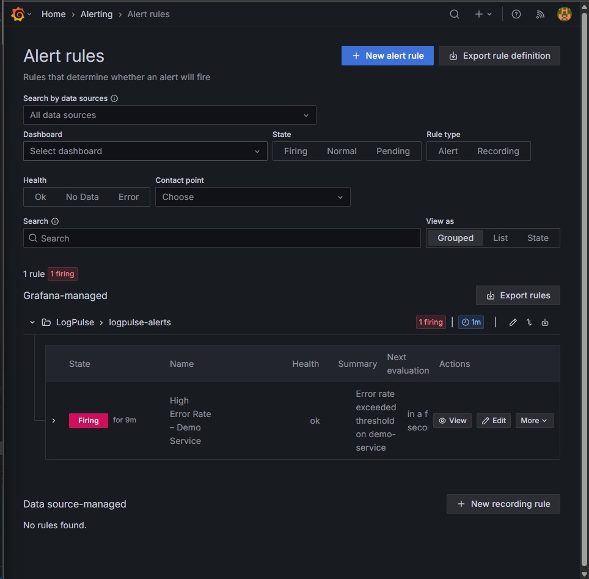

# LogPulse Observability

Production-grade log aggregation and visualization system using Loki, Promtail, and Grafana. Dockerized observability stack with structured logging, log shipping, dashboards, and alert-ready architecture.


---

## Overview

LogPulse is a complete observability stack demonstrating centralized log aggregation, structured logging, log parsing, and real-time visualization.

## Architecture

```
Log Generator (Python)
    ↓
Promtail (Log Shipper)
    ↓
Loki (Log Aggregation)
    ↓
Grafana (Visualization)
    ↓
User (Dashboard)
```

### Components

| Component | Role | Port |
|-----------|------|------|
| **Loki** | Log aggregation engine | 3100 |
| **Promtail** | Log shipper/forwarder | N/A |
| **Grafana** | Dashboard & visualization | 3000 |
| **Log Generator** | Sample app producing logs | N/A |

---
---

## Quick Start

### Prerequisites

- Docker & Docker Compose
- 2GB free disk space
- Ports 3000, 3100 available

### 1. Start the Stack

```bash
cd logpulse-observability
docker compose up -d
```

**Expected output:**
```
✓ logpulse_loki is healthy
✓ logpulse_promtail is running
✓ logpulse_grafana is healthy
✓ logpulse_generator is running
```

### 2. Check Services

```bash
docker compose ps
```

All 4 containers should show **Up** status.

### 3. Access Grafana

Open: **http://localhost:3000**

**Default credentials:**
- Username: `admin`
- Password: `admin123`

### 4. View Logs

1. Go to **Explore** (left sidebar)
2. Select **Loki** datasource
3. Run query:
   ```
   {service="log-generator"}
   ```
4. Click **Run query** → See logs streaming live

---

## Log Generator

The Python app generates structured JSON logs every 2 seconds.

### Log Format

```json
{
  "timestamp": "2024-01-15T10:30:45.123Z",
  "level": "INFO",
  "service": "demo-service",
  "message": "[req-000001] [user-042] User login successful",
  "logger": "logpulse"
}
```

### Configure

```bash
# Adjust log interval (seconds)
docker compose down
# Edit docker-compose.yml, service: log-generator, environment
# Change LOG_INTERVAL value
docker compose up -d
```

---

## Loki Configuration

### Storage

- **Type**: Filesystem
- **Location**: `/loki/chunks` (Docker volume)
- **Retention**: 7 days

### Query Capabilities

```
# All logs from the demo service
{service="log-generator"}

# By service name label
{service_name="demo-service"}

# By log level
{level="ERROR"}

# Filter errors with JSON parsing
{service="log-generator"} | json | level="ERROR"

# Error rate over time (used in dashboard)
sum(count_over_time({level="ERROR"}[1m]))

# Log volume over time (used in dashboard)
sum(count_over_time({service_name="demo-service"}[1m]))
```

---

## Promtail Configuration

### Log Scraping

- **Source**: Docker containers
- **Discovery**: Automatic (Docker socket)
- **Parsing**: JSON with field extraction

### Labels (Attached to Logs)

- `service` - Docker Compose service name (e.g. `log-generator`)
- `service_name` - Application-level service name (e.g. `demo-service`)
- `level` - Log level extracted from JSON (`INFO`, `ERROR`, `WARNING`, `DEBUG`)
- `container` - Container name (e.g. `logpulse_generator`)
- `job` - Job name (mirrors container name)

---

## Grafana Dashboards

### Auto-Provisioned

- Loki datasource pre-configured
- Ready for custom dashboard creation

### LogPulse – Service Overview Dashboard

Pre-built dashboard with 3 panels:

| Panel | Query | Type |
|-------|-------|------|
| Log Volume (1m) | `count_over_time({service_name="demo-service"}[1m])` | Time series |
| Error Count (1m) | `count_over_time({level="ERROR"}[1m])` | Time series |
| Error Rate % | `sum(errors) / sum(total) * 100` | Time series |

### Alert Rule

- **Name**: High Error Rate – Demo Service
- **Condition**: `sum(count_over_time({level="ERROR"}[5m]))` IS ABOVE 10
- **Evaluation**: every 1m, pending 1m
- **Group**: LogPulse → logpulse-alerts

### Alert Firing (Live Demo)



---

## Health Checks

All services include health checks:

```bash
# Check service health
docker compose exec loki wget -q -O- http://localhost:3100/ready
docker compose exec grafana wget -q -O- http://localhost:3000/api/health
```

---

## Logs & Diagnostics

### View Service Logs

```bash
# All services
docker compose logs -f

# Specific service
docker compose logs -f loki
docker compose logs -f promtail
docker compose logs -f grafana
docker compose logs -f log-generator
```

### Troubleshooting

**"No logs appearing in Grafana"**
- Check Promtail logs: `docker compose logs promtail`
- Verify Loki is healthy: `docker compose ps`
- Wait 30 seconds for log generation to start

**"Cannot connect to Grafana"**
- Ensure port 3000 is not in use
- Check: `docker compose logs grafana`
- Restart: `docker compose restart grafana`

**"Retention period warnings"**
- Logs older than 7 days are automatically deleted
- To increase, edit `loki-config.yaml` `retention_period` value

---

## Security (Production)

For production deployment:

1. **Change Grafana credentials**
   ```yaml
   environment:
     - GF_SECURITY_ADMIN_PASSWORD=<secure_password>
   ```

2. **Enable authentication in Loki**
   ```yaml
   auth_enabled: true
   ```

3. **Use environment variables for secrets**
   ```bash
   docker compose --env-file .env.production up -d
   ```

4. **Add reverse proxy** (nginx/traefik)
   ```yaml
   services:
     nginx:
       # configuration
   ```

---

## Performance

- **Log ingestion**: 16 MB/s (configurable)
- **Burst capacity**: 24 MB/s
- **Storage**: Filesystem (upgrade to S3/GCS for production)
- **Retention**: 7 days automatic deletion
- **Query latency**: <1s for recent logs

---

## Development

### Modify Log Generator

Edit `app/log-generator.py`:

```python
# Change message frequency
interval = float(os.getenv("LOG_INTERVAL", "2"))

# Add custom fields
log_entry["custom_field"] = "value"

# Change log levels distribution
log_levels = ["INFO", "WARNING", "ERROR", "DEBUG"]
```

Rebuild:
```bash
docker compose build log-generator
docker compose up -d
```

### Extend Promtail Config

Add new job in `promtail-config.yaml`:

```yaml
scrape_configs:
  - job_name: my_app
    static_configs:
      - targets: [localhost]
        labels:
          job: my_app
```

---

## Cleanup

### Stop Stack

```bash
docker compose down
```

### Stop & Remove Data

```bash
docker compose down -v
```

---


## Author

[Mithileshan](https://github.com/Mithileshan)

---

